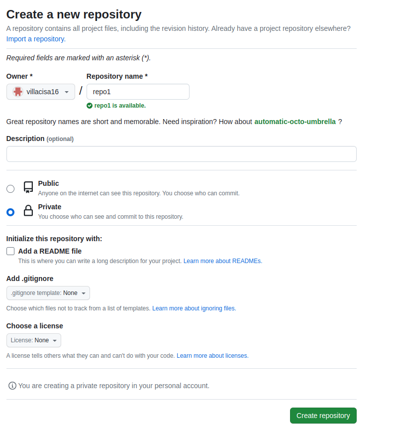
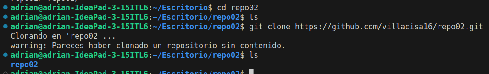
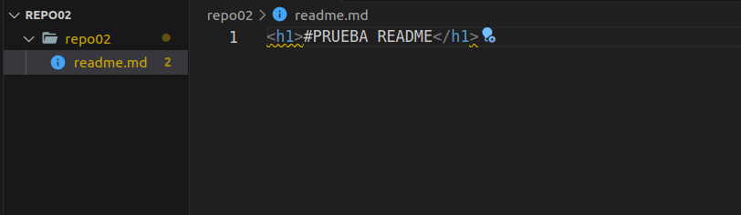
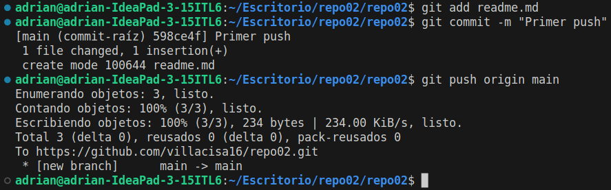

<h1>#PRUEBA README</h1>
□ 2.1 - Crea un repositorio llamado repo02 desde GitHub. ¿Sería considerado un repositorio
local o remoto?

<b>Es considerado un repositorio remoto, ya que inicialmente sólo se encuentra en la nube.</b>

□ 2.2 – Posteriormente, clónalo (mediante al comando git clone), lo que realizará una copia
del repositorio remoto en nuestro equipo, creando con ello un repositorio local a partir del
repositorio en remoto

□ 2-3 - Añade un fichero readme.md y ejecuta los comandos pertinentes hasta llegar a poder
realizar un commit.

□ 2.4 – Entra en este manual de Markdown y haz un resumen de los principales comandos de
Git con los que hemos trabajando. Puedes utilizar tablas, imágenes, títulos, enlaces, etc.

<b></b>

|Comandos git | Definición  | Ejemplo  |
|:--- |:---- | :---- |
|1. add| Funciona para incluir los cambios de archivos para el siguiente commit | git add {archivo} |
|2. Commit| Confirma cambios de los archivos añadidos con add en local. Se adjunta un mensaje. | Git commit -m "Mensaje  de modificaciones" |
|3. push| Envía cambios al repositorio remoto | git push origin main |